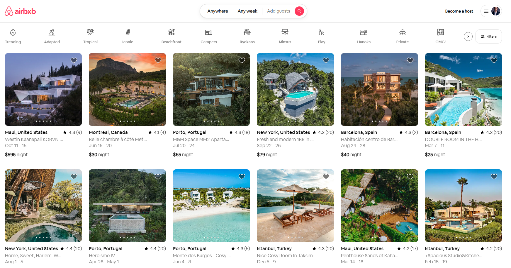

# :tv: Airbxb

Airbxb is a property & houses rental App.

✅ Users can search house using the search bar.  
✅ Users can explore different house by filter them by filterModal.  
✅ Users can access information related to a specific house.  
✅ Authenticated users can add or delete house from their personal dashbord.  
✅ The app is fully responsive and it adapts to any screen size.  
✅ The app was developed while considering the Web Content Accessibility Guidelines (WCAG).  
 
:link: Link to the live project: [Link](https://air-bxb.onrender.com/)  
 

 

## My Process:

I developed the project over the course of approximately A week and a half. In order to learn as much as I can from the development of this project, I implemented certain features from scratch including accessible and scrollable tabs, a carousel functionality, and infinite loading.

### Tools.

After designing a prototype of the application using Adobe XD, I started developing the app using the following technologies:

- Vue.js. 
- javascript.

- SCSS modules (CSS grid & CSS Flexbox & Media queries)
- Vue router, Font Awesome (Icons)

